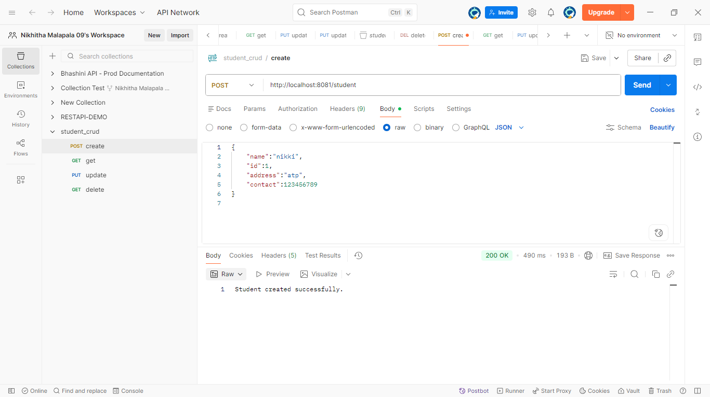

# 📘 Student REST API (CRUD)

A lightweight and well-structured RESTful API built using Spring Boot to manage student data. This project demonstrates core backend concepts like HTTP methods, request handling, and JSON-based communication.

# 🛠️ Tech Stack

Java – Core programming language

Spring Boot – Backend framework

Spring Web – REST API development

Maven – Dependency management

Postman – API testing

# 📂 Project Structure
Student_RESTAPI_crud

│── src/main/java/stu/example/student

│   ├── controller        # REST endpoints (API layer)

│   ├── model             # Student data model

│   ├── StudentApplication.java   # Entry point

│

│── src/main/resources     # Configuration files

│── src/test/java/...      # Test classes

│

│── pom.xml                # Project dependencies

│── README.md

# ⚙️ Getting Started

1. Clone the Repository
   
   git clone https://github.com/Nikhitha999-nikki/Student_RESTAPI_crud.git
   
   cd Student_RESTAPI_crud

3. Run the Application
   
Open the project in any Java IDE (IntelliJ / Eclipse)

Run StudentApplication.java

5. Server
   
   http://localhost:8081

📬 API Endpoints

The application exposes REST endpoints for:
| Method | Operation              |
| ------ | ---------------------- |
| POST   | Create a student       |
| GET    | Retrieve all students  |
| GET    | Retrieve student by ID |
| PUT    | Update student details |
| DELETE | Delete student         |

# Postman :

